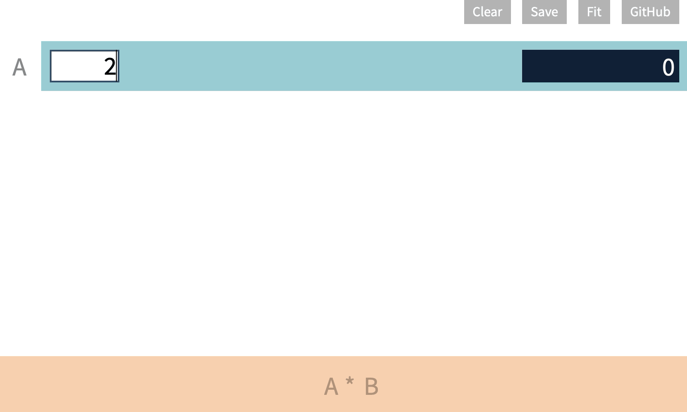
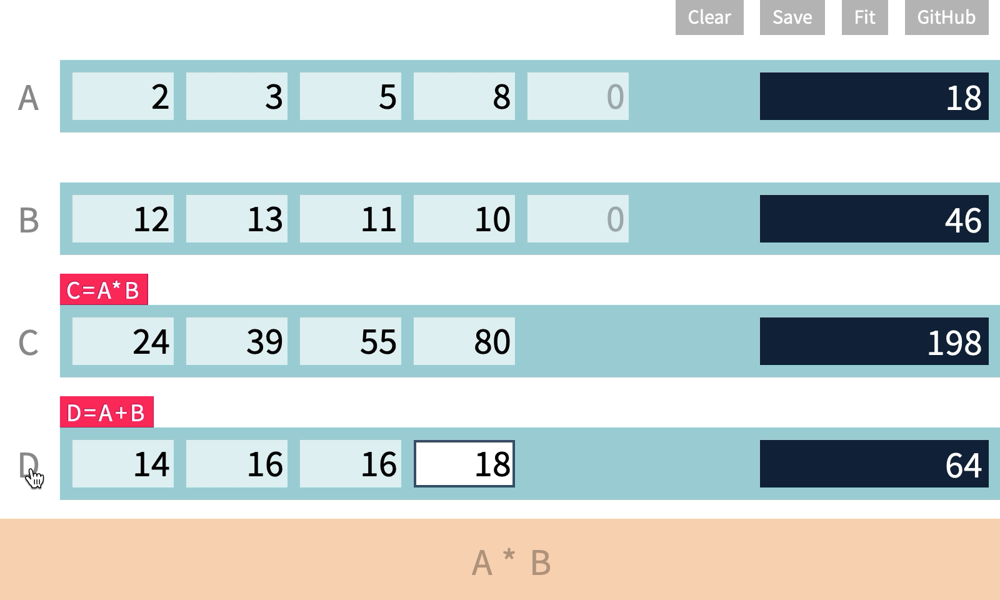

# ListCalc

A web calculator for performing element-wise operations on lists.
[Open in browser](https://iamfranco.github.io/listCalc/)

### Input entries and compute

* A list can be manually created and modified by inputting entries. Press the `ENTER` key to move onto next entry.
* Every list has a **black box** at the right that shows the **sum** of its entries.
* Every list has a **reference alphabet** at the left.
* A list can also be computed using a **formula**, such as `A * B`. More on that later.

---
### Formula
A formula can contain:
  * reference alphabets, such as (`A`, `B`, `C`),
  * numerical operations, such as (`+`,`-`,`*`,`/`), and
  * decimal numbers, such as (`1`, `3.14`, `-99.9`).

Numerical operations will be performed in an element-wise fashion.

---
### Plot list entries

You can plot a list by
clicking on its **reference alphabet**.